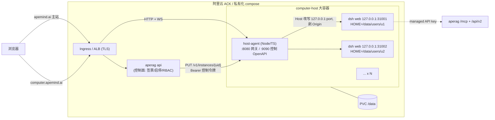
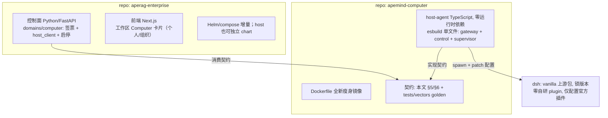
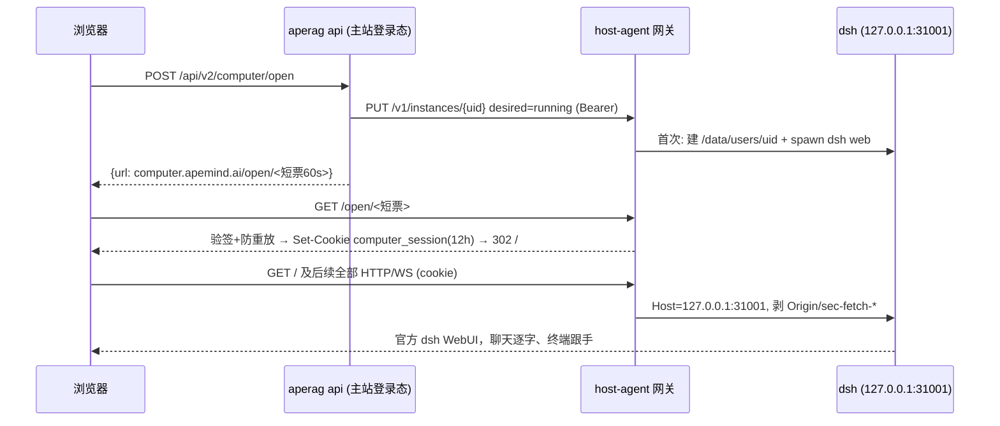

# Computer：SaaS 化多租户 dsh 架构

本文回答 computer-host 作为独立多租户 dsh 服务，如何与 ApeMind 协作、数据怎么走、身份怎么签、镜像和隔离怎么做。

落地口径：个人一人一台；组织一组织一台（实例键 `org-{org_id}`，成员共用同一 HOME 与进程）。ApeMind 只做控制面（签票 + 调启停），`user_id` 对 host 完全不透明，零 dsh plugin 代码。

## 0. 一句话架构

**computer-host 是一个独立的多租户 dsh SaaS 服务**：一个大容器 = 一个 host-agent（Node 单进程：公网网关 + 控制 OpenAPI + dsh supervisor）+ N 个 vanilla `dsh web` 进程（每租户一个，绑 127.0.0.1）。ApeMind 与它的全部关系就两条线：**给登录用户签一张短票**（用户拿票进网关）、**调它的控制 OpenAPI 启停实例**。数据路径 浏览器 → Ingress → host-agent → 回环 dsh 一跳直达，ApeMind 不在数据路径上。

没有 daemon、没有 FRP、没有隧道、没有 join token、没有 aperag 里的 ASGI 代理、**没有自研 dsh plugin**。



## 1. 服务边界：独立到什么程度

原则：**独立性是契约的属性，不靠额外基础设施**。

- host-agent 对 ApeMind 零知识：`user_id` 只是一个不透明租户字符串（来自签名票据和控制调用）；managed API key 只是一个透传注入的 env。host 不访问 ApeMind 的用户库、不调用 ApeMind 的任何 API。
- ApeMind 侧的全部专有知识（登录态、RBAC、key 签发、UI）都留在 aperag。将来若要彻底独立运营或接其他 IdP，只需换「签票方」，host 一行不改。
- 因此**不做** user 数据库同步、不做 OIDC provider、不做用户信息查询 API；票据里带 user_id 已够路由与归属。

## 2. 技术分层与代码落点



**aperag-enterprise（Python/FastAPI + Next.js）**

- `aperag/domains/computer/`：薄控制面——
  - 路由：`POST /api/v2/computer/open`、`POST /api/v2/computer/stop`、`GET /api/v2/computer`；可选查询参数 `org_id` 切到组织实例。
  - `ticket.py`：HMAC 签票（`v1.<b64url>.<hmac>`，无 DB）。
  - `host_client.py`：httpx 薄客户端。
  - managed key 签发（复用 `api_key` 表 `is_managed`，无新表）。打开时注入当前操作者的 Computer 托管密钥。
- `web/src/app/workspace/computer/`：单卡片页（状态 / 打开 / 停止）；组织工作区带 `org_id`。
- 实例状态 source of truth 在 host，aperag 实时查询。零新业务表。

**apemind-computer（本仓库）**

- `host-agent/`：TypeScript，零运行时依赖（`node:http/net/crypto/child_process/fs`），esbuild 打成单文件进镜像。三个模块一个进程：
  - `gateway.ts`：`/open/<ticket>` 验票发 cookie；其余按 cookie → 端口表反代；WS 在 `upgrade` 事件重写握手行后 `socket.pipe()` 对拷。
  - `control.ts`：`:9090` 控制 OpenAPI 实现（Bearer 校验）。
  - `supervisor.ts`：实例状态机（create/spawn/backoff/idle-stop/wake/delete），每实例 `meta.json` 落盘。
- 票据格式见 §5；控制 API 见 §6；跨语言 golden vectors 在 `tests/vectors/`。
- `Dockerfile`：见 §8。镜像只在 GitHub Actions 构建。
- `deploy/`：独立 Helm chart（Secret、PVC、Deployment、Service、Ingress）。

**dsh 层：vanilla，锁版本，零自研代码**（见 §3）。

## 3. 不写 dsh plugin

逐项核对需求，全部可用「配置 + 环境 + 进程外网关」覆盖：

- 身份/访问控制 → 网关在 dsh 进程外完成，dsh 零登录。
- 知识库/ApeMind 能力 → 官方 `@deepseek-ai/dsh-mcp-client` 插件（streamable-http + Bearer header），纯配置。
- 模型接入 → 官方 provider 配置（BYOK 用户自填；平台 key 增值时注入 provider 块）。
- 托管配置注入 → `dsh web --patch`：官方 patch overlay，managed 配置与用户自己的配置文件互不覆盖。

不写 plugin 的理由：dsh 处于 developer preview，plugin API 会破坏性变更；给托管 dsh 加 ApeMind 能力的正确扩展点是 aperag 侧的 MCP 工具——服务端发版即所有存量实例生效。未来仅当必须改 dsh UI 本身（品牌化、内嵌账号指示器）才评估写 plugin。

## 4. URL / 域名

- 生产 `computer.apemind.ai`，staging `computer-staging.apemind.ai`。**单域名服务所有租户**，会话 cookie 决定路由，无需泛域名证书；与主站 cookie 完全隔离。
- Ingress：`computer.apemind.ai → svc/computer-host:8080`；主站规则不动。私有化：客户域名指同一端口或 compose 直接暴露。
- **多 host 扩展路径（保留设计位，不实现）**：每 host 一个子域 `c1.computer.apemind.ai` + 泛域名证书；aperag 记 user→host 指派表并在签票时选择对应子域；票据/契约本身不含 host 信息。不做跨 host 转发网格。

## 5. 登录 / 打开流程

票据与会话全部无状态 HMAC（`v1.<b64url(json)>.<hmac-sha256>`），aperag 与 host-agent 共享 `COMPUTER_TICKET_SECRET`：

```
v1.<body>.<sig>
```

- `body`：JSON 负载经 base64url 编码（无 `=` 填充）。
- `sig`：`HMAC-SHA256(secret, body)` 的十六进制小写摘要。
- 短票 payload `{"t":"ticket","u":"<user_id>","e":<unix秒>,"n":"<nonce>"}`，60 秒，网关内存防重放。
- 会话 cookie payload `{"t":"session","u":"<user_id>","e":<unix秒>}`，默认 12 小时，HttpOnly + Secure + SameSite=Lax。
- `u` 对 host 不透明，须匹配 `^[A-Za-z0-9_-]{1,64}$`。个人实例用原始用户 id；组织实例用 `org-{org_id}`。



- dsh 零登录零账号：只见到回环 Host 的请求，天然过它的 /api fence；不配 trustedHosts、不改 dsh。
- 带 Origin 的请求先校验 `Origin == https://computer.apemind.ai`（或对应 staging Origin）再剥头。
- 唤醒语义：cookie 有效 + 实例存在但闲置回收 → 网关自己拉起；用户主动停止的不自动唤醒 → 302 主站；实例从未创建 → 302 主站。
- 组织实例：任一在职成员可打开/停止同一 `org-{org_id}`；停止影响该组织所有成员。MCP 身份跟随最近一次真正拉起进程的操作者。

跨语言一致性靠 `tests/vectors/` golden vectors 单测锁住。

## 6. ApeMind ↔ computer-host 契约（控制 OpenAPI）

`:9090`，仅集群内可达，Bearer `COMPUTER_CONTROL_TOKEN`：

- `PUT /v1/instances/{user_id}`：幂等 ensure。body `{desired: running|stopped, env?: {APEMIND_API_KEY?...}}`。同步返回 `{status, port, started_at, last_activity}`。
- `GET /v1/instances/{user_id}`、`GET /v1/instances`：状态（running/stopped/error、RSS、last_activity）。
- `DELETE /v1/instances/{user_id}`：停进程 + 删工作区（重置）。
- `GET /healthz`：容量/负载/版本。

协议版本走 `/v1` 路径。实现以 `host-agent/src/control.ts` 为准。

## 7. host-agent 行为细节

- **supervisor 状态机**：`created → running ⇄ idle-stopped → deleted`，另有 `error(backoff)`。spawn 命令模板 `dsh {patch} --profile web --no-open --port {port}`（`{patch}` 在租户存在 `~/.apemind/managed.cordis.yml` 时展开为 `--patch <该文件>`）；每租户 `HOME=/data/users/<key>`、`DSH_HOME=$HOME/.dsh`、独立 XDG；崩溃指数退避，闲置自动 stop（默认 1800s）；端口重启后重新分配（cookie 只含 user_id，与端口无关）。HOME 目录 0700。逐状态转换、目录所有权与数据流细节见 [lifecycle.md](lifecycle.md)。
- **网关转发卫生**：剥 `Origin/Referer/sec-fetch-*`、`Accept-Encoding: identity`、响应加 `X-Accel-Buffering: no`；WS 重写 `Host` 后原始 socket 对拷。
- **可观测**：结构化 JSON 日志（不落 prompt/key/文档内容），实例数/RSS/活跃度进 `/healthz`。

## 8. Docker 镜像设计

AIO 底座（Xvfb/Chromium/VNC/noVNC/supervisord/nginx/gem-server/tinyproxy/bubblewrap）整体弃用。托管 dsh WebUI 用不到桌面沙箱，却带来体积、架构限制和多余攻击面。若未来要浏览器自动化/桌面，另起独立镜像轨道。

全新镜像（node:22-bookworm-slim，amd64+arm64）：系统层提供租户 shell 环境与隔离工具；全局安装锁定版本的 `@deepseek-ai/dsh`；host-agent esbuild 单文件；`tini` 作 PID 1。暴露 8080/9090，数据卷 `/data`。

- host-agent 以 root 运行（需要 setuid 切租户 uid 与 iptables）；容器保持尽可能少的 capability，P2 回环隔离时加 `NET_ADMIN`。
- 私有化扩展点：客户 `FROM apecloud/apemind-computer` 再 apt 加自己的工具链。
- 构建发布：GitHub Actions 推 tag `v*.*.*`；不在本地 build。镜像名 `apecloud/apemind-computer`。

## 9. 隔离与资源

1. **per-user uid**：每实例独立 uid，HOME 0700。
2. **回环防串访**：否则租户 A 一条 `curl 127.0.0.1:31002` 即可操纵租户 B 的 dsh。iptables `-m owner --uid-owner` 只放行 host-agent uid 访问 dsh 端口段。
3. **资源限额**：Node `--max-old-space-size` + host-agent 内存 watchdog；cgroup 委托可用时按实例设 memory.max/pids.max。
4. 残余风险：同容器共享内核、dsh 执行任意 shell，恶意租户逃逸风险非零；强隔离升级路径是 per-user pod/microVM（牺牲密度，不进本期）。

密度目标：活跃实例约 300–500MB RSS，闲置回收后单 64–128GB 节点服务数百注册用户。

## 10. 保留与舍弃

保留：`/open/<短票>` + 域名隔离 cookie 的入口 UX；HMAC 票据格式；header 卫生清单；每用户环境布局；产品锁（个人一人一台、组织一组织一台、进官方 dsh Web、身份只认 ApeMind、票据不可分享）；验收口径（聊天逐字、终端跟手）；staging 域名。

舍弃：aperag ASGI 代理与 frp/tunnel、出站控制路由与旧 computer 表、admin join 配置区、computers 列表页；镜像内 frpc/computerd 出站协议与整个 AIO reconstructed 底座；frps Helm。

## 11. 交付与验收

验收清单（ACK staging）：

1. 主站点开 → 短票 → cookie → dsh WebUI 完整可用；WS 101、聊天逐字、终端跟手
2. 双用户双实例：cookie 互换/伪造/过期票/复用票全部拒绝；A 实例内看不到 B 的文件
3. 闲置回收后 cookie 直达自动唤醒；用户主动停止后不唤醒
4. host 容器重启：工作区持久、点开即恢复
5. 组织工作区两名成员看到同一实例；非成员 404
6. dsh 内用 MCP 工具能调到打开者身份下的 ApeMind 能力

## 12. 风险与开放项

- dsh developer preview 破坏性变更 → 镜像锁版本；上游 bearer 认证若落地，网关可再简化。
- 单 host 单点：v1 接受（replicas=1 + PVC）；扩展走每 host 子域 + aperag 指派表。
- `--patch` overlay 的具体行为按锁定版本实测；若不支持，退化为首次创建时写入 managed 条目到用户配置。
- 隔离等级与逃逸风险见 §9。
- 组织 MCP 身份目前跟随打开者，没有组织级 API 密钥表。
- Settings → Models 在非 loopback 浏览器 hostname 下会不可用，这是上游 dsh 设计，模型/密钥走租户配置注入。

## 读完后能回答的问题

- ApeMind 为什么不在数据路径上？
- 个人和组织的实例键分别是什么，谁可以打开/停止？
- 短票和会话 cookie 各自活多久、字段是什么？
- 控制 API 有哪些端点、鉴权是什么？
- 为什么不写 dsh plugin？
- 回环隔离要防的是哪一种串访？
