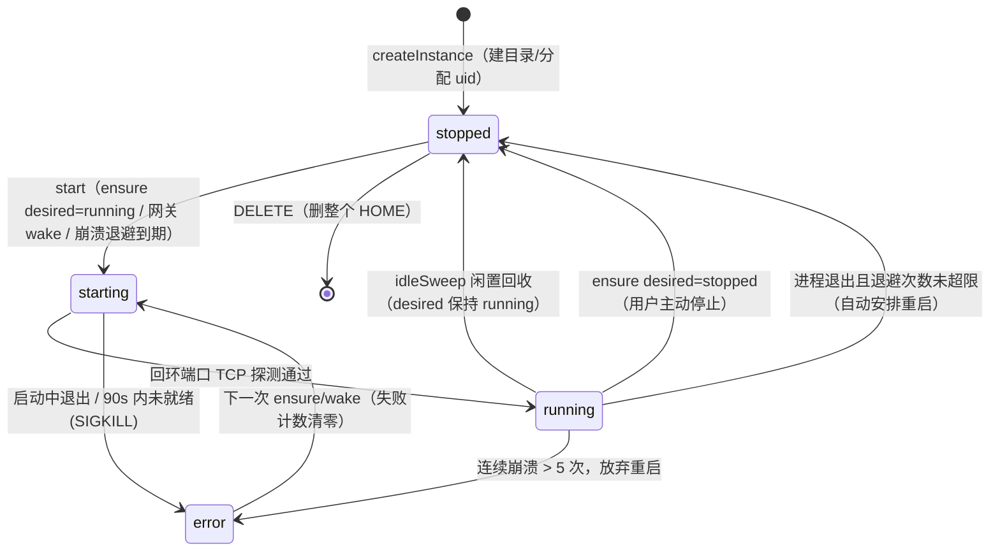
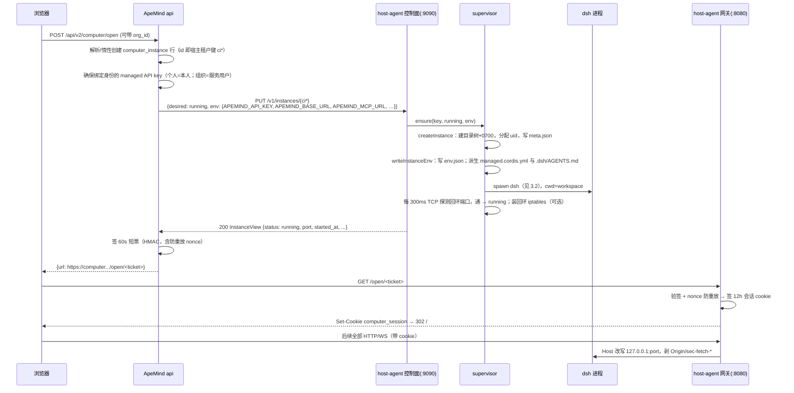

# dsh 生命周期与数据流

[architecture.md](architecture.md) 回答「computer-host 是什么、边界在哪、契约长什么样」。[pairing.md](pairing.md) 回答控制面如何第一次连上宿主、密钥存在哪。[stability.md](stability.md) 回答「dsh 崩了谁救、host-agent 崩了谁救、一户内存爆了怎么只死这一户」。本文放大其中一层：**一台托管 dsh 从无到有、从活跃到休眠再到删除，每一步谁触发、host-agent 做了什么、磁盘上留下什么**。所有行为以 `host-agent/src/`（supervisor / gateway / control）与 ApeMind 侧 `aperag/domains/computer/` 的当前实现为准；默认参数来自 `host-agent/src/config.ts`。

心智模型：把每个实例当成一台 **scale-to-zero 的数据库实例**——存储（租户 HOME 目录）常驻在 PVC 上，计算（`dsh web` 进程）按需拉起、闲置回收；唤醒靠流量触达，不靠常驻心跳。

## 1. 目录组织

### 1.1 布局

数据根 `COMPUTER_DATA_DIR`（默认 `/data`，挂 PVC）。每个实例一棵目录树，实例键即目录名：ApeMind 的 `computer_instance.id`（`ci` + 16 hex），对宿主不透明，必须匹配 `^[A-Za-z0-9_-]{1,64}$`。镜像里另有一份全租户共用的 CLI，不在 PVC 上：

```
/usr/local/bin/apemind               镜像内置 CLI（构建时锁版本 + sha256），所有实例进程经 PATH 共用
/data/users/<instance_key>/          HOME，0700（防跨租户遍历，与 uid 隔离无关，恒开）
  workspace/                         dsh 进程的 cwd；agent 读写的文件都在这里
  .dsh/                              DSH_HOME：dsh 自己的会话、缓存、settings
    AGENTS.md                        托管引导（host-agent 按 env.json 渲染，手工编辑下次 spawn 覆盖）
  .apemind/                          托管注入面，只有 host-agent 写：
    meta.json                        实例持久状态（desired / createdAt / uid），0600
    env.json                         控制面注入的环境变量（含 APEMIND_API_KEY），0600
    managed.cordis.yml               dsh --patch 挂载的托管配置（MCP + 模型投影），0600
    dsh.log                          dsh 进程 stdout/stderr，追加写，0600
  .config/apemind/                   托管 CLI 凭证（host-agent 按 env.json 写 default profile）
    config.json                      current_profile=default，0600
    profiles/default/state.json      base_url + api_key，0600
  .config/  .cache/  .local/share/   XDG 三件套，指给 dsh 与租户内工具
```

目录树在实例首次创建时一次建齐；开启 uid 隔离（`COMPUTER_UID_BASE > 0`）时整棵树 chown 给该实例分配的 uid。

### 1.2 所有权：谁写哪一块

| 区域 | 写入方 | 性质 |
| --- | --- | --- |
| `/usr/local/bin/apemind` | 镜像构建 | 全租户共用只读二进制，不随 PVC、不随实例删除 |
| `.apemind/` | 只有 host-agent（受控制面 ensure 驱动） | **投影**。权威在 ApeMind 数据库（绑定身份的 managed key、MCP 地址、模型清单）；磁盘上这份只是启动进程所需的物化，删了可以从控制面重新生成 |
| `.dsh/AGENTS.md` | 只有 host-agent | **托管引导**。权威是 `env.json`；每次 spawn 前重写。`.dsh/` 其余文件仍是 dsh 私有 |
| `.config/apemind/` | 只有 host-agent | **CLI 凭证投影**。dsh 从 bash/工具子进程剥掉名字含 KEY、PASSWORD、SECRET、TOKEN 的环境变量，agent 跑 `apemind` 时读不到 `APEMIND_API_KEY`；这份 profile 是 CLI 的官方 env 回退。权威仍是 `env.json`，每次 ensure/spawn 覆盖 |
| `.dsh/` 其余 | 只有 dsh 进程 | 上游运行时私有。ApeMind 不读它当配置源，也不把它回流主站 |
| `workspace/` | 租户（经 dsh agent） | 用户磁盘。闲置回收、host 重启都保留；只在显式删除实例时销毁 |

这个分界是双向承诺：ApeMind 改配置永远走「更新数据库 → ensure 重投影」，不直接改 `.dsh/settings.yaml`；反过来 dsh 里发生的会话、用户自己改的偏好也不会被 ApeMind 收走。落在 `$DSH_HOME` 与 `$XDG_CONFIG_HOME` 里的托管文件（`AGENTS.md`、CLI profile）是宿主派生的，手工编辑下次 spawn 覆盖。

### 1.2.1 CLI 与绑定身份（open 注入，落盘持久化）

- **二进制位置**：`/usr/local/bin/apemind`，镜像层。dsh 进程的 `PATH` 继承自 host-agent，所以 agent 开箱就能跑 `apemind`。升级 CLI = 换镜像 tag，不改 PVC。
- **身份在何时注入**：`POST /api/v2/computer/open`。控制面确保绑定身份的托管 key（个人=用户本人，组织=该组织服务用户），把 `APEMIND_API_KEY`、`APEMIND_BASE_URL`（由 MCP URL 去掉 `/mcp`）、组织实例另加 `APEMIND_ORG_ID` 一并放进 ensure 的 `env`。宿主整体重写该实例 `.apemind/env.json`，并派生 `managed.cordis.yml`、`.dsh/AGENTS.md` 与 `.config/apemind/` CLI profile。
- **会不会持久化**：会。权威投影是 `env.json`（PVC，0600）。同一轮 ensure/spawn 再写一份 CLI profile（`$XDG_CONFIG_HOME/apemind`，0700/0600），因为 dsh 工具子进程会剥掉 `APEMIND_API_KEY`，CLI 必须靠这份文件认证。MCP 与模型网关仍读 dsh **进程**环境里的 key，不受剥离影响。闲置唤醒再 spawn 时两份一起按 `env.json` 重写。下一次 open 整体覆盖（key 轮换走这条）。进程已 running 时 open 只改磁盘：CLI 下次调用即读到新 profile，不必等冷启动；MCP/LLM 的进程环境要等下一次 spawn。

### 1.3 删除语义

控制面 `DELETE /v1/instances/{key}` = 停进程 + 拆回环 iptables 规则 + **`rm -rf` 整个 HOME**。工作区、会话、注入配置一起消失；下一次 ensure 从零重建。这是「重置」，不是「停止」。目前没有产品页面入口，属于运维操作。

## 2. 实例状态机

两个正交的状态：

- **desired**（持久，落 `meta.json`）：`running | stopped`。只有控制面 ensure 会改。表达「租户希望这台机器开着还是关着」。
- **status**（内存）：`stopped | starting | running | error`。host-agent 重启后全部归 `stopped`，靠 desired 与流量恢复。



转换细节：

- **启动就绪判定**：spawn 后每 300ms 探测一次回环端口，`settings.json` 的 `ready_timeout_sec`（出厂 90s）内通即 `running`；超时 SIGKILL 并抛 StartError（控制面收到 409）。ApeMind 的 ensure HTTP 超时 120s，就是为了盖住这 90s——**冷启动是同步阻塞的**，接口返回时实例已可用或已明确失败。
- **停止**：SIGTERM，`settings.json` 的 `stop_grace_sec`（出厂 10s）内没退干净则 SIGKILL。
- **崩溃退避**：`running` 中的进程意外退出且 desired 仍是 running 时，按 `min(500ms × 2^n, 30s)` 退避自动重启；连续超过 5 次转 `error` 放弃。任何一次 ensure/wake 都会清零失败计数、重新尝试。
- **端口是易耗品**：每次启动从 `COMPUTER_PORT_BASE`（默认 31000）向上找空闲端口，重启后端口可能变。会话 cookie 只含实例键不含端口，所以对用户透明。
- **host-agent 重启**：`init()` 扫 `/data/users/` 逐个读 `meta.json` 恢复注册表，所有实例 status=stopped，**不主动拉起任何进程**；desired=running 的实例等第一个带合法 cookie 的请求把它唤醒。冷备恢复语义与闲置回收完全一致。host-agent 进程自己退出时由 Docker / K8s 整容器拉起，镜像内不再套自动重启，见 [stability.md](stability.md)。

## 3. 生命周期时序与控制面调用

### 3.1 冷启动（第一次打开）



### 3.2 spawn 参数（事实清单）

命令模板 `COMPUTER_DSH_COMMAND`，默认：

```
dsh {patch} --profile web --no-open --port {port}
```

- `{port}`：本次分配的回环端口。
- `{patch}`：存在 `.apemind/managed.cordis.yml` 时展开为 `--patch <该文件>`，否则消失。launcher 标志必须在 web 应用自身标志之前，所以模板里用显式占位符控制位置。

进程环境（不继承 host-agent 的环境，白名单构造）：

| 变量 | 值 |
| --- | --- |
| `PATH` / `LANG` | 继承 PATH；LANG 默认 `C.UTF-8` |
| `HOME` | `/data/users/<key>` |
| `USER` | 实例键 |
| `DSH_HOME` | `$HOME/.dsh` |
| `XDG_CONFIG_HOME` / `XDG_CACHE_HOME` / `XDG_DATA_HOME` | `$HOME/.config` / `.cache` / `.local/share` |
| `APEMIND_USER_ID` | 实例键（对 host 不透明的租户字符串） |
| `env.json` 里的全部键值 | 控制面注入。当前契约：`APEMIND_API_KEY`（绑定身份托管 key）、`APEMIND_BASE_URL`（MCP URL 去掉 `/mcp`，CLI 用）、`APEMIND_MCP_URL`、`APEMIND_LLM_BASE_URL`、`APEMIND_LLM_MODELS`；组织实例另有 `APEMIND_ORG_ID`。键名限 `^[A-Z][A-Z0-9_]{0,63}$` |

uid 隔离开启时以分配的 uid/gid 运行；stdout/stderr 进 `.apemind/dsh.log`。

`managed.cordis.yml` 有两段内容，都按 env 是否齐全条件渲染：

- **MCP 工具**（`APEMIND_MCP_URL` + `APEMIND_API_KEY`）：插入官方 `@deepseek-ai/dsh-mcp-client` 插件行，streamable-http 指向 MCP 地址，Authorization 头用 `!!js` 从**进程环境**读 `APEMIND_API_KEY`。
- **模型提供方投影**（`APEMIND_LLM_BASE_URL` + `APEMIND_API_KEY` + 非空 `APEMIND_LLM_MODELS`）：在 `llm-pi-ai` 行的 config 上合并一个名为 `apemind` 的 provider（`api: openai-completions`、`baseURL` 指 ApeMind 的 OpenAI 兼容网关、`apiKeyEnv: APEMIND_API_KEY`），模型列表来自 `APEMIND_LLM_MODELS`——一个 JSON 数组，元素 `{id, name?, context_window?, vision?}`。`id` 是 ApeMind 模型 id（dsh 发起补全时原样回传，网关按它解析上游）；`name` 写成 dsh `PiAiModelProfile.name`（选择器文案），不是 provider 级的 `displayName`。JSON 非法或元素缺 `id` 时 ensure 直接失败（控制面 400），不写任何文件。每次拉起 dsh 都会按当时的 `env.json` 重写 patch，避免宿主升级后仍读到旧 yaml。

两段都只携带环境变量名，密钥不落在 yaml 里，文件泄露不等于密钥泄露（`env.json` 仍含密钥本体，0600 + uid 隔离保护）。patch 对 dsh 的实际生效行为按锁定的 dsh 版本在 staging 验收（与 MCP 行同一口径）。

`$DSH_HOME/AGENTS.md`（工作区引导，官方 `dsh-agent-instructions` 自动加载）同样按 env 条件渲染：`APEMIND_API_KEY` + `APEMIND_BASE_URL` 齐全时生成，包含绑定身份入口（`apemind whoami` / `apemind skills`）、`APEMIND_ORG_ID` 存在时的默认组织行、MCP 与模型行。它是托管文件——每次拉起 dsh 前按 `env.json` 重写，手工编辑不保留；只出现 env 变量名与 id，不出现密钥。镜像内置 `apemind` CLI（`/usr/local/bin/apemind`，构建时锁版本 + sha256 校验），实例进程经继承的 `PATH` 直接可用，配合注入的 `APEMIND_BASE_URL`/`APEMIND_API_KEY`/`APEMIND_ORG_ID` 免登录工作。

### 3.3 再次打开 / 换人打开（实例已存在）

同一条 `POST /open` 路径，ensure 幂等：

- 目录已在，跳过创建；`env` 字段存在则**整体重写** `env.json`、patch 与 `AGENTS.md`。
- 进程已 running 则不动——**正在运行的进程环境不会变**。组织实例的绑定身份是服务用户（与谁打开无关）；open 把同一把服务 key 再写进 `env.json`，运行中进程仍用上一次 spawn 读到的那份，要生效等下一次冷启动。这是当前接受的语义（见 architecture.md §5）。
- 每次 open 都签发新的 60s 短票；旧会话 cookie 不受影响，同一浏览器多标签共享同一 cookie。

### 3.4 闲置回收与唤醒（scale-to-zero 主循环)

**没有心跳协议。** 活跃度就是网关观测到的数据面流量：

- 每个代理的 HTTP 请求 touch 一次 `lastActivity`；
- WebSocket 双向任何数据帧都 touch（1 秒节流，避免热连接高频写时间戳）；
- dsh 自己不上报任何东西，浏览器页面关闭 → WS 断 → 流量归零。

回收循环：supervisor 每 60s 扫一遍，`status=running` 且 `now - lastActivity > idle_timeout_sec`（出厂 1800s = 30 分钟，见 `/data/settings.json`）的实例停进程。**desired 保持 running**——这正是「休眠」和「用户主动停止」的区别。

唤醒路径（网关内联完成，不经过 ApeMind）：

1. 带合法 cookie 的请求到达网关；
2. 实例存在且 desired=running、status≠running → 网关调 `wake()` 同步拉起（用 `env.json` 现存内容），就绪后继续反代本次请求；
3. 浏览器感知到的只是这一次请求慢了几秒（dsh 启动 + 就绪探测）。

对照数据库的说法：`desired` 是「实例是否存在于服务目录」，`status` 是「计算是否在跑」，HOME 是永远在线的存储层，唤醒延迟 = 进程启动时间（秒级），计费/容量只看 running 数。

各请求形态在异常态的响应（HTML 指 `GET`/`HEAD` 且 `Accept` 含 `text/html`）：

| 场景 | HTML 请求 | API/WS 请求 |
| --- | --- | --- |
| 无/过期 cookie | 302 主站 `/workspace/computer` | 401 / WS 403 |
| 实例从未创建 | 302 主站 | 404 |
| desired=stopped（用户主动停的） | 302 主站 | 503 / WS 403 |
| desired=running 但唤醒失败 | 502 | 502 |

### 3.5 用户主动停止

`POST /api/v2/computer/stop` → ensure `desired=stopped` → SIGTERM/SIGKILL 停进程。之后网关**不会**唤醒它（wake 只作用于 desired=running），HTML 访问一律 302 回主站。恢复的唯一路径是再点一次「打开」。组织实例上任何成员 stop 对全组织生效。

### 3.6 控制面调用总表

| 触发 | ApeMind 行为 | host-agent 控制 API | host 侧动作 |
| --- | --- | --- | --- |
| 工作区页加载 + 每 10s 轮询 | `GET /api/v2/computer` | `GET /v1/instances/{key}` | 返回 InstanceView；404 → 前端显示「尚未创建」 |
| 点「打开」 | `POST /api/v2/computer/open` | `PUT /v1/instances/{key}` desired=running + env | 建目录/写注入/拉进程/等就绪，同步返回 |
| 点「停止」 | `POST /api/v2/computer/stop` | 先 `GET`，存在才 `PUT` desired=stopped | 停进程，desired 落盘 |
| 管理员「校验连接」 | 后台配置页 probe | `GET /healthz` | 返回 version、实例计数/上限、load1、空闲内存 |
| 重置租户（无产品入口） | 运维直调 | `DELETE /v1/instances/{key}` | 停进程 + 删 HOME，204 |
| 撤权（移出成员/改角色/停用组织） | 事务成功后 best-effort 调用 | `POST /v1/instances/{key}/revoke-sessions` | 会话代数 +1 落盘，存量会话 cookie 全部失效 |

鉴权全部是 `Authorization: Bearer $COMPUTER_CONTROL_TOKEN`（常量时间比较）。错误映射：401 未认证、400 参数/实例键非法、404 实例不存在、409 启动失败（StartError）、507 容量满（实例数达 `max_instances` 或端口耗尽）。ApeMind 侧把非 200 统一包装成 ComputerHostErrorException 冒给前端。

## 4. 数据面：请求怎么流

### 4.1 浏览器 → 网关 → dsh

网关是数据路径上唯一一跳（ApeMind 不在数据路径上）。转发卫生：

- **请求**：剥 `Origin` / `Referer` / `sec-fetch-*`（dsh 的回环信任门禁才会放行）、hop-by-hop 头、`Accept-Encoding` 固定 `identity`（禁压缩，保逐字流式）；`Host` 改写为 `127.0.0.1:<port>`；`computer_session` cookie 从 Cookie 头里**剥掉再转发**，dsh 看不到会话凭证，租户自己的其他 cookie 原样保留。
- **响应**：剥 hop-by-hop 头，加 `X-Accel-Buffering: no`（提示外层 Ingress 不缓冲）。
- **WebSocket**：`upgrade` 事件里手写重构握手行（同样的头卫生 + Host 改写），然后两条 socket 原始对拷；数据帧驱动活跃度 touch。
- **进门校验**：带 `Origin` 的请求必须等于 `COMPUTER_PUBLIC_ORIGIN` 才放行（无 Origin 或 `null` 视为非跨站导航，放行）；`/open/<ticket>` 验签 + 单进程内存 nonce 防重放（60s 内复用直接 403）。

### 4.2 dsh → ApeMind（MCP 与模型回程）

托管 dsh 对 ApeMind 的回程有两条，都用同一把 managed key 做 Bearer：

- **MCP**：`managed.cordis.yml` 挂的官方 MCP 客户端插件，streamable-http 直连 `APEMIND_MCP_URL`。这条是**在线 RPC**，不是文件同步——知识库内容不会被镜像进 `workspace/`。
- **模型补全**：投影的 `apemind` provider 把补全请求发到 `APEMIND_LLM_BASE_URL`（ApeMind 的 OpenAI 兼容网关 `/v1/llm`），`model` 字段是 ApeMind 模型 id；网关在 ApeMind 侧解析成真实提供方账号（base_url + 密钥）后原样透传，提供方密钥永远不进租户环境。

managed key 的生命周期在 ApeMind 侧：`api_key` 表里 `is_managed=true, protected_reason="computer"` 的行，每用户至多一把活跃的，复用或按需创建；吊销/轮换只影响 MCP 回程，不影响实例进程本身。

### 4.3 互通清单（含明确不做的）

| 数据 | 方向与通道 | 状态 |
| --- | --- | --- |
| 身份 / 谁能开机 | 只在 ApeMind（登录态 + 组织成员校验）；host 只见不透明实例键 | 已有 |
| 绑定身份的 managed API key、MCP / CLI 地址 | ApeMind → ensure env → `.apemind/env.json` → dsh 进程环境；身份是个人本人或组织服务用户，与谁点开无关 | 已有 |
| 模型提供方目录 | ApeMind → ensure env（`APEMIND_LLM_BASE_URL` / `APEMIND_LLM_MODELS`）→ `managed.cordis.yml` provider 行；补全流量走 ApeMind OpenAI 兼容网关（ApeMind 为权威，dsh 设置页在非 loopback 浏览器下本就不可用） | 已有 |
| CLI 二进制与凭证 | 镜像 `/usr/local/bin/apemind`；进程 env 给 MCP/LLM；CLI profile 给 agent 的 bash | 已有 |
| 知识库 / 检索 / 智能体工具 | dsh → MCP 在线调用；写面 / 长尾走 CLI | 已有 |
| `workspace/` 文件 | 只属于这台实例；不自动入库、不回流主站 | 恒定边界 |
| `.dsh/AGENTS.md` | host-agent 按 env 派生；其余 `.dsh/` 只属于 dsh | 已有 |
| `.dsh/` 会话与偏好 | 只属于 dsh；ApeMind 不读不写 | 恒定边界 |
| dsh 聊天记录 ↔ ApeMind 对话历史 | 不互通 | 恒定边界 |

## 5. 参数速查

| 参数 | 默认 | 语义 |
| --- | --- | --- |
| `idle_timeout_sec`（`/data/settings.json`） | 1800 | 闲置回收；`0` 关闭。热更新见 [host-settings.md](host-settings.md) |
| `ready_timeout_sec` | 90 | 冷启动就绪窗口；探测间隔 300ms |
| `stop_grace_sec` | 10 | SIGTERM 后宽限，超时 SIGKILL |
| `session_ttl_sec` | 7200（2h） | 会话 cookie 寿命；实例被 `revoke-sessions` 后立刻整体失效 |
| 短票 TTL | 60s（ApeMind 侧常量） | `/open/<ticket>` 兑换窗口，一次性 |
| `COMPUTER_PORT_BASE` / `max_instances` | 31000 / 200 | 回环端口段与容量上限 |
| `COMPUTER_UID_BASE` / `COMPUTER_LOOPBACK_ISOLATION` | 0（关）/ 关 | 每实例 uid 与回环 iptables 隔离；staging 开启（uidBase=20000） |
| 崩溃退避 | min(500ms×2ⁿ, 30s)，连续 >5 次放弃 | 代码常量 |
| ApeMind ensure HTTP 超时 | 120s（读接口 10s） | 盖住 90s 就绪窗口 |
| 前端状态轮询 | 10s | 工作区 Computer 页 |

## 6. 不解决什么

- 多 host 调度与租户指派（architecture.md §4 留了子域扩展位；每台 host 的配对见 pairing.md）。
- 按租户拆 Pod/microVM 的强隔离。
- dsh 版本升级流程（镜像 tag + 回归，见 README）。
- 正在 running 的进程热替换 env：open 只改磁盘，进程环境要等下一次冷启动。

## 读完后能回答的问题

- 冷启动时 ApeMind 调哪个 API？host-agent 依次做哪些事、进程用什么参数和环境起来？
- `apemind` CLI 在哪、身份何时注入、会不会持久化、持久化在哪一层？
- `.apemind/`、`.dsh/`、`workspace/`、镜像层 CLI 分别归谁写，删实例时哪些数据消失？
- 「闲置休眠」和「用户主动停止」在状态机里差在哪个字段？各自怎么恢复？
- 为什么不需要心跳？活跃度信号从哪来，多久无流量会停，唤醒发生在哪一层？
- 闲置超时的权威在 env 还是磁盘，控制面怎么改（host-settings.md）？
- 组织实例换人打开后，绑定身份会不会换成那个成员？MCP / CLI 用的是谁？
- host-agent 容器重启后，正在休眠/运行的实例分别经历什么？
