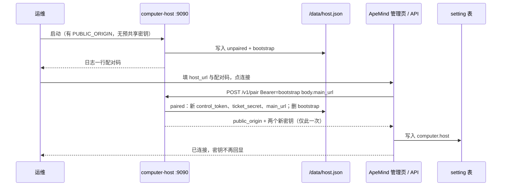
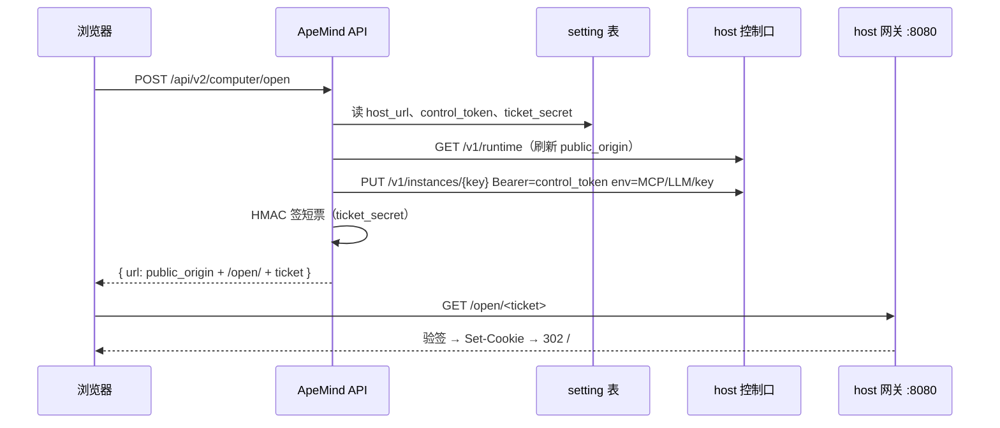

# ApeMind 与 computer-host 的配对和认证

[architecture.md](architecture.md) 回答「两边怎么分工、票据长什么样、控制 API 有哪些」。本文放大其中一层：**两个独立仓库、两种部署形态（Kubernetes 与 Docker Compose）下，控制面如何第一次连上宿主、密钥存在哪、一对多怎么约束**。

落地前现状：两边用环境变量预共享 `COMPUTER_TICKET_SECRET` 与 `COMPUTER_CONTROL_TOKEN`（见 architecture.md §5、§6）。本文是目标契约——人只配控制地址和一次配对码，其余敏感信息经控制口交换，分别写入 ApeMind 数据库和宿主磁盘。实现切换时必须保留预共享模式，避免已有部署立刻不可用。

本文不是旧形态的 join token：没有用户机器上的 daemon、没有 FRP、没有隧道。配对只发生在 **ApeMind API 进程** 与 **computer-host 控制口 `:9090`** 之间。

## 0. 一句话

computer-host 第一次启动生成一次性配对码；ApeMind 管理员把控制地址和配对码填进主仓，调 `POST /v1/pair`；双方交换长期控制令牌、签票密钥和对外 Origin，各自落盘。之后日常启停与打开仍走 architecture.md 已有的 Bearer 控制调用和 HMAC 短票，不再手填密钥。

## 1. 基数：一对一，以及为什么

**v1 是一对一：一套 ApeMind 部署配一台 computer-host。** 一台 computer-host 也只接受一个控制面配对。

原因都落在密钥和租户命名空间上，不是产品口味：

- **签票密钥是共享 HMAC。** 短票和会话 cookie 用同一把密钥签验。两套 ApeMind 若共用一台宿主、共用一把密钥，任何一边都能为任意实例键签打开链接。两套 ApeMind 若各用一把密钥，宿主验签只能认其中一把，另一边的票全部 403。
- **实例键对宿主不透明。** 个人键是 ApeMind 的 `user.id`，组织键是 `org-{org_id}`。两套 ApeMind 接到同一宿主时，两边的用户 id 会撞车，HOME 目录会串。
- **回跳主站只有一个。** 无会话时网关 302 到 `{main_url}/workspace/computer`。一台宿主不能同时把用户送回两套主站。
- **MCP / 模型网关回程绑的是打开时注入的那套 ApeMind 地址和托管 key。** 多控制面共用一台宿主时，租户进程里的 `APEMIND_MCP_URL` 会指向「最后一次 ensure 的那套主仓」，跨部署串号。

因此：

| 关系 | v1 | 以后 |
| --- | --- | --- |
| 1 套 ApeMind ∶ 1 台 host | **要做** | 默认 |
| 1 套 ApeMind ∶ N 台 host | 不做 | architecture.md §4 的扩展位：每 host 一个子域，ApeMind 记 user→host 指派，**每台 host 单独配对、单独签票密钥** |
| N 套 ApeMind ∶ 1 台 host | **明确不做** | 不开放。要拆就拆成多台 host |
| 1 台 host ∶ N 个租户 dsh | 已有 | 多租户是宿主内部的事，与「几个控制面」无关 |

一对一的强制点：

- 宿主：磁盘上只保留一份已配对状态。未配对时只接受配对码；已配对后配对码作废，第二次 `POST /v1/pair` 用配对码会 409。重新配对必须先用当前控制令牌解绑或轮换（§7）。
- ApeMind：`setting` 表 `computer.host` 仍是一行。要做 1∶N 时再加「多 host 行」，不把多套密钥塞进这一行。

## 2. 人要配什么，机器自己换什么

不依赖 Kubernetes Secret 当配置总线。Compose 和 Helm 走同一协议。

**人配（宿主）**

- 浏览器能打开的对外 Origin（Ingress / 端口映射 / `COMPUTER_PUBLIC_ORIGIN`）。这是 DNS 和证书事实，进程启动就要用来校验 `Origin` 头和 cookie `Secure`。
- 数据目录、容量、隔离档位、监听端口。只属于宿主。

**人配（ApeMind）**

- 控制 API 地址（Compose 常见 `http://computer-host:9090`，集群内是 Service DNS）。
- 一次性配对码（从宿主日志或 `host.json` 拷出来，贴进管理页，点一次连接）。
- 本仓对外地址（已有 `APEMIND_PUBLIC_URL`），用来推导 MCP / 模型网关，并在配对时告诉宿主当 `main_url`。

**配对之后机器交换、不再手填**

| 材料 | 谁生成 | ApeMind 存哪 | 宿主存哪 | 用途 |
| --- | --- | --- | --- | --- |
| 配对码 | 宿主，未配对时 | 不存 | `/data/host.json`，成功后删除 | 只用于 `POST /v1/pair` |
| 控制令牌 | 配对时宿主新生成 | `setting` / `computer.host` | `/data/host.json` | 之后所有 `:9090` 调用的 Bearer |
| 签票密钥 | 配对时宿主新生成（一次） | 同上 | 同上 | HMAC 短票与会话 cookie |
| 对外 Origin | 宿主启动配置，权威在宿主 | 配对响应写入，打开时再读一次 | 启动 env + `host.json` 副本 | ApeMind 拼 `/open/<ticket>`；网关校验 Origin |
| 主站 URL | ApeMind 对外地址 | 已有 | 配对请求写入 `host.json` | 无会话 / 已停止时 302 回工作区 Computer 页 |
| 租户 MCP / LLM / API Key / 模型清单 | 每次打开时 ApeMind 现算 | 用户/模型库 | 该租户 `.apemind/env.json` 与 `managed.cordis.yml` | 已有 ensure 注入，不进配对 |

环境变量里的 `COMPUTER_TICKET_SECRET` / `COMPUTER_CONTROL_TOKEN` 只保留为 **未配对时的兼容启动垫**（现网、本地 compose 仍可预填）。配对成功后以磁盘为准，不再要求这两项 env。

## 3. 状态与磁盘

宿主数据根仍是 `COMPUTER_DATA_DIR`（默认 `/data`）。租户树在 `/data/users/<key>/`，见 [lifecycle.md](lifecycle.md) §1。配对状态是 **宿主级** 文件，不放进某个租户 HOME：

```
/data/host.json     0600
```

未配对示例：

```json
{
  "state": "unpaired",
  "bootstrap": "<高熵随机串>",
  "bootstrap_created_at": "2026-08-31T00:00:00.000Z"
}
```

已配对示例（密钥仅示意形状，真实值不进日志、不进 GET）：

```json
{
  "state": "paired",
  "control_token": "<长期令牌>",
  "ticket_secret": "<HMAC 密钥>",
  "public_origin": "https://computer.example.com",
  "main_url": "https://app.example.com",
  "paired_at": "2026-08-31T00:01:00.000Z"
}
```

ApeMind 侧继续用已有 `setting` 键 `computer.host` 一行 JSON，配对成功后至少包含：`enabled`、`host_url`、`control_token`、`ticket_secret`、`public_origin`。管理页 GET 只回 `control_token_set` / `ticket_secret_set` 和对外 Origin 明文（Origin 不是密钥）。

宿主进程启动读配置的顺序：

1. 存在 `/data/host.json` 且 `state=paired` → 用文件里的令牌和签票密钥；`public_origin` 仍以启动 env 为准（Ingress 改了必须重启宿主，ApeMind 下次探活再跟上）。
2. 否则若 env 同时提供了预共享的签票密钥和控制令牌 → **兼容模式**，行为与今天相同，可随时再走配对把密钥收进文件。
3. 否则生成配对码写入 `host.json`（`state=unpaired`），日志打印一行提示去管理页粘贴。不把配对码打进每次启动日志。

## 4. 接口

控制口仍是 `:9090`，**不得**挂到对外 Ingress。公开入口只有网关 `:8080`。Compose 把 9090 留在 compose 网络内；Kubernetes 用 ClusterIP Service。

鉴权：`Authorization: Bearer <token>`。未配对时 token 只能是配对码；已配对时只能是长期控制令牌。配对码与长期令牌同时有效的窗口不存在。

### 4.1 `POST /v1/pair`

第一次把控制面绑到这台宿主。

请求：

```json
{
  "main_url": "https://app.example.com"
}
```

`main_url` 必须是 http(s) URL，去掉末尾 `/`。Bearer 为当前配对码。

成功 200：

```json
{
  "public_origin": "https://computer.example.com",
  "control_token": "<新长期令牌，只在这一次响应里出现>",
  "ticket_secret": "<新签票密钥，只在这一次响应里出现>",
  "paired_at": "2026-08-31T00:01:00.000Z"
}
```

副作用：写入 `/data/host.json` 为 `paired`；删除配对码；此后配对码立即 401。ApeMind 必须把响应写入数据库，丢了只能走 §7 重新配对。

错误：

| HTTP | 何时 |
| --- | --- |
| 401 | Bearer 不是当前配对码 |
| 400 | `main_url` 非法 |
| 409 | 已经 `paired`（应改走解绑或轮换） |
| 503 | 宿主还没有可用的 `public_origin`（启动配置缺失） |

### 4.2 `GET /v1/runtime`

已配对后只读视图，Bearer 为长期控制令牌。不回任何密钥。

```json
{
  "state": "paired",
  "public_origin": "https://computer.example.com",
  "main_url": "https://app.example.com",
  "version": "v0.2.1",
  "paired_at": "2026-08-31T00:01:00.000Z"
}
```

未配对时用配对码调用：只回 `{ "state": "unpaired" }`，不含 `public_origin` 以外的敏感字段；`public_origin` 可以回，方便管理页在点连接前展示「将要打开的域名」。

`GET /healthz` 保持今天的容量/负载/版本，已配对后 **增加** `public_origin`（不是密钥）。兼容旧客户端多出来的字段应忽略。

### 4.3 `PUT /v1/runtime`

已配对。Bearer 为长期控制令牌。用于主站 URL 变更，不必重新配对。

```json
{ "main_url": "https://app.example.com" }
```

成功 200，body 与 GET 相同。非法 URL 400。未配对 409。

### 4.4 `POST /v1/unpair`

已配对。Bearer 为当前长期控制令牌。删除 `host.json` 里的令牌和签票密钥，重新生成配对码，状态回到 `unpaired`。进行中的会话 cookie 全部失效；实例进程可以继续跑，但浏览器必须重新从 ApeMind 打开。

成功 200：`{ "state": "unpaired" }`。新配对码不在 HTTP 响应里（避免被代理日志收走），只写回 `host.json` 与一条启动同款日志。

### 4.5 已有实例接口不变

`PUT/GET/DELETE /v1/instances/...` 与 `GET /healthz` 的鉴权改为「已配对则只用长期控制令牌」。ensure 注入租户 env 的契约仍见 lifecycle.md §3.2。

## 5. 流程

### 5.1 第一次配对（Compose 或集群相同）



ApeMind 侧「校验连接」在未配对时用配对码打 `GET /v1/runtime` 或 `GET /healthz`；已配对后改用库里的控制令牌。

### 5.2 打开 Computer（配对完成后，与今天相同）



`public_origin` 以宿主 `GET /v1/runtime` 为准。库里那份是缓存，打开时刷新，避免 Ingress 改域名后管理页没保存仍跳到旧源。刷新失败则退回库里的值，并在控制面日志打可聚合的错误（不含密钥）。

### 5.3 无会话回跳

网关发现没有合法 cookie、或实例被用户停掉时，302 到 `host.json` 的 `main_url` + `/workspace/computer`。`main_url` 来自配对请求，之后用 `PUT /v1/runtime` 更新。不要再靠 Helm 默认值 `https://apemind.ai` 把私有化用户送去公网主站。

## 6. 认证分层（配对之后日常怎么信）

三层互不替代：

1. **用户打开 dsh**：浏览器只信网关。进门是 HMAC 短票，之后是 `computer_session` cookie。密钥是签票密钥。ApeMind 登录态只证明「可以让控制面去签票 / ensure」，到不了 `:8080`。
2. **ApeMind 指挥宿主**：服务端调 `:9090`，Bearer 长期控制令牌。浏览器拿不到。
3. **租户 dsh 回调 ApeMind**：进程里的 managed API key，走 MCP 和 `/v1/llm`。与上面两把密钥无关；吊销 key 不影响已打开的网关会话。

配对码只出现在第 0 层（绑定）。绑定完成后它不存在，不能打开实例，也不能当会话 cookie。

## 7. 丢失、轮换、重配

| 事故 | 做法 | 影响 |
| --- | --- | --- |
| ApeMind 数据库丢失，宿主还在 | 宿主 `POST /v1/unpair`（若令牌也丢了，运维删 `/data/host.json` 后重启），再配对 | 新签票密钥，旧打开链接和 cookie 失效；租户 HOME 保留 |
| 宿主磁盘丢失，ApeMind 还在 | 新宿主生成新配对码；管理页重新连接，覆盖 `computer.host` | 工作区没了（PVC 没了）；密钥全换 |
| 怀疑控制令牌泄漏 | 用当前令牌 `unpair` 再 `pair`，或以后加 `POST /v1/rotate` 只换令牌不换签票密钥 | 控制面调用立刻改口令；已打开的 dsh 会话可保留（若未换签票密钥） |
| 怀疑签票密钥泄漏 | 必须重新配对（换 HMAC） | 全部 cookie 与未兑现短票失效，用户重新点打开 |
| 配对码泄漏但尚未 pair | 重启宿主或删 `host.json` 再起，生成新码 | 无长期密钥被换出 |
| 主站域名变更 | `PUT /v1/runtime` 更新 `main_url` | 无需重配 |
| 宿主对外域名变更 | 改宿主启动 Origin 并重启；ApeMind 下次打开或点校验会读到新值 | 旧 Origin 上的 cookie 按浏览器源隔离，等于要重新打开 |

并发：`POST /v1/pair` 在进程内串行。两个 ApeMind 同时拿同一配对码配对，只有一个 200，另一个 401 或 409。一对一由此在协议层锁死。

时钟：短票 60s、会话默认 12h，两边用 Unix 秒。时钟偏差大会导致「刚签的票已过期」。配对协议本身不依赖短窗口，但打开链路仍要求 NTP 大致对齐（现有票据已如此）。

## 8. 部署形态

**Docker Compose**：`computer-host` 服务不把密钥写进长期 `.env`。暴露 8080 给浏览器；9090 只进 compose 网络。ApeMind 的 `COMPUTER_HOST_URL=http://computer-host:9090`。管理员从 `docker compose logs computer-host` 取配对码，在主仓管理页连接。

**Kubernetes**：独立 chart 继续配 `publicOrigin`、Ingress、PVC。Secret 里不再作为两边同步密钥的唯一来源；chart 可以不设 `ticketSecret`/`controlToken`，让进程走未配对生成。ApeMind Deployment 也不再注入这两项——配对结果在数据库。控制 Service 保持 ClusterIP。

**预共享兼容**：现网已经用 env 注入两把密钥的，启动落在 §3 第 2 步，行为与今天一致。管理页「连接」可以在兼容模式下把现有密钥 **收编** 进 `host.json`（Bearer 用当前控制令牌调一个 `POST /v1/adopt` 亦可并进 `POST /v1/pair` 的已配对 409 分支：若 Bearer 已是 env 控制令牌且 state 尚未 paired，则生成文件、不轮换密钥）。收编细节实现时选一条，不要两条都做。

## 9. 安全约束

- 配对响应里的两个密钥只出现在这一次 HTTPS/内网 HTTP 响应体。结构化日志字段禁止 `bootstrap`、`control_token`、`ticket_secret`、cookie、票据正文。
- `GET /v1/runtime` 与 `GET /healthz` 永不回密钥。
- ApeMind 管理配置 GET 继续只给 `*_set`。
- 控制口不进对外 Ingress。配对码熵不低于 128 bit，URL-safe。
- 宿主不主动访问 ApeMind。配对也是 ApeMind 连过来。宿主继续对 ApeMind 用户库零知识。
- 不要用配对码当打开票据，也不要把签票密钥当控制 Bearer。

## 10. 和现有文档的关系

- 票据格式、cookie 属性、实例键规则：architecture.md §5，不改。
- ensure / 租户目录 / MCP 与模型投影：lifecycle.md，不改。
- 本文只替换「两把密钥从哪来」这一段：从「人在两处 env 填同一对」换成「配对交换后各存各的」。
- 多 host 子域仍是 architecture.md §4 的保留位；每台 host 重复本文的一对一配对。

## 11. 不解决什么

- 不实现 1 套 ApeMind 对 N 台 host 的调度和指派表。
- 不实现 N 套 ApeMind 共用一台 host。
- 不把空闲超时、uid、Ingress 证书收进配对。
- 不在配对里交换租户模型清单或 API Key。
- 不引入 OIDC、双向 TLS 客户端证书、或 K8s Secret 同步控制器作为前置。
- 不把 `:9090` 暴露到公网再靠配对码保平安。
- 本文是契约设计；在 `host-agent` 与 ApeMind `domains/computer` 落地并保留预共享兼容之前，现网仍按环境变量共享密钥运行。

## 读完后能回答的问题

- 为什么 v1 必须一对一，1∶N 和 N∶1 各卡在什么密钥或命名空间上？
- 人还要填哪几项？签票密钥和控制令牌分别谁生成、存在哪、第一次之外还要不要手填？
- `POST /v1/pair` 的请求、一次性响应、以及 409 是什么意思？
- 打开 Computer 时 public_origin 以谁为准？
- 数据库丢了或 PVC 丢了怎么重新连，会话会怎样？
- 这和已经废弃的用户侧 join token / FRP 有什么边界？
