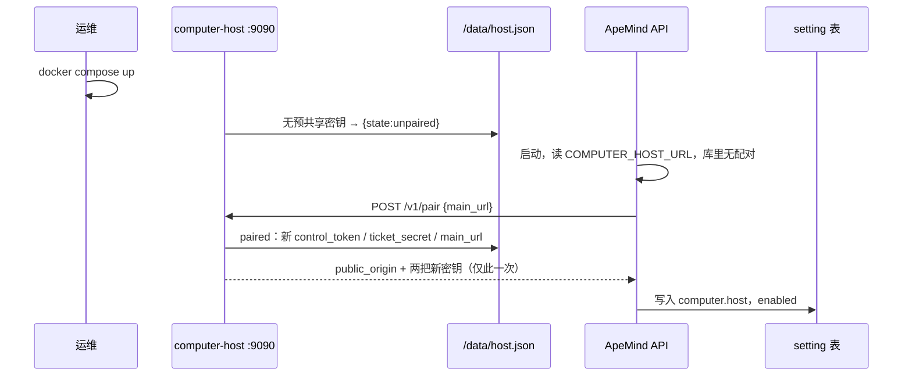
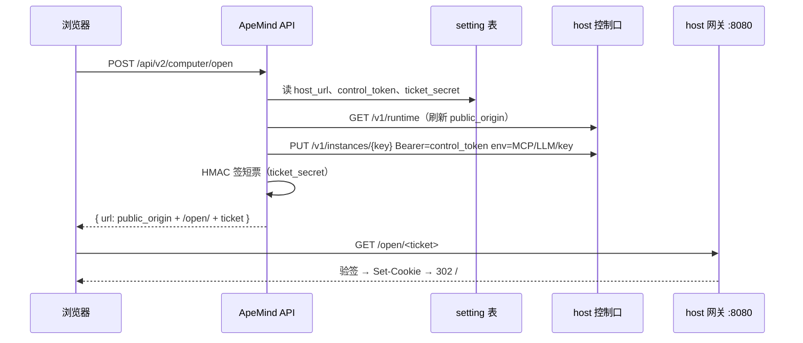

# ApeMind 与 computer-host 的配对和认证

[architecture.md](architecture.md) 回答「两边怎么分工、票据长什么样、控制 API 有哪些」。本文放大其中一层：**两个独立仓库、两种部署形态（Kubernetes 与 Docker Compose）下，控制面如何第一次连上宿主、密钥存在哪、一对多怎么约束**。

落地前现状：两边用环境变量预共享 `COMPUTER_TICKET_SECRET` 与 `COMPUTER_CONTROL_TOKEN`（见 architecture.md §5、§6）。本文是目标契约——密钥不再要求人搬运，配对在控制口上自动完成，结果分别写入 ApeMind 数据库和宿主磁盘。实现切换时必须保留预共享模式，避免已有部署立刻不可用。

本文不是旧形态的 join token：没有用户机器上的 daemon、没有 FRP、没有隧道。配对只发生在 **ApeMind API 进程** 与 **computer-host 控制口 `:9090`** 之间。

## 0. 一句话

宿主未配对时，控制口接受第一个 `POST /v1/pair`（先到先得）；ApeMind 只要知道控制地址，就在启动或管理页点连接时自动配对，换出长期控制令牌与签票密钥，各自落盘。Compose 里两个服务一起拉起即完成，人不搬运任何密钥；共享网络的部署可启用可选配对码加一道门。

## 1. 为什么默认没有配对码

第一性原理：**bootstrap 凭据只有走带外通道（人从宿主一侧拿到、攻击者拿不到）才提供额外安全**。

- 让宿主生成码、人从日志或磁盘拷出来贴进管理页——安全，但把最麻烦的一步留给了人，而这套系统的目标就是少让人碰。
- 让宿主提供接口或页面把码交给 ApeMind 展示——码走的是攻击者同样能走的网络路径，能读码的人就能直接配对。安全性与没有码**完全等价**，只是多一步仪式。
- 宿主唯一的页面面是公网网关 `:8080`，在那里展示配对码等于向公网展示；控制口 `:9090` 上做无鉴权「读码」接口就是上一条的等价情形。

所以默认干脆不设码：**未配对的宿主在控制口上先到先得**。它信任的边界和系统长期信任的边界是同一条——「能到 `:9090` 的只有控制面」。配对完成后这条边界继续靠长期控制令牌把守；配对前的空窗只有服务拉起到自动配对的几秒。抢先配对的攻击者也无法隐身：真正的 ApeMind 来配时收到 409，管理页立刻显示异常（§7）。

仍要更强 bootstrap 的部署（控制网络里跑着不可信负载），用**运维自设**的配对码：宿主 env 设 `COMPUTER_PAIR_CODE`，同一个值配进 ApeMind（env 或管理页填一次）。码是人选的、装机时写的，不是宿主生成再让人搬的，之后长期密钥仍然自动生成、自动交换。

## 2. 基数：一对一，以及为什么

**v1 是一对一：一套 ApeMind 部署配一台 computer-host。** 一台 computer-host 也只接受一个控制面，先到先得使这条约束在协议层字面成立。

原因都落在密钥和租户命名空间上，不是产品口味：

- **签票密钥是共享 HMAC。** 短票和会话 cookie 用同一把密钥签验。两套 ApeMind 若共用一台宿主、共用一把密钥，任何一边都能为任意实例键签打开链接。两套 ApeMind 若各用一把密钥，宿主验签只能认其中一把，另一边的票全部 403。
- **实例键对宿主不透明。** 个人键是 ApeMind 的 `user.id`，组织键是 `org-{org_id}`。两套 ApeMind 接到同一宿主时，两边的用户 id 会撞车，HOME 目录会串。
- **回跳主站只有一个。** 无会话时网关 302 到 `{main_url}/workspace/computer`。一台宿主不能同时把用户送回两套主站。
- **MCP / 模型网关回程绑的是打开时注入的那套 ApeMind 地址和托管 key。** 多控制面共用一台宿主时，租户进程里的 `APEMIND_MCP_URL` 会指向「最后一次 ensure 的那套主仓」，跨部署串号。

| 关系 | v1 | 以后 |
| --- | --- | --- |
| 1 套 ApeMind ∶ 1 台 host | **要做** | 默认 |
| 1 套 ApeMind ∶ N 台 host | 不做 | architecture.md §4 的扩展位：每 host 一个子域，ApeMind 记 user→host 指派，**每台 host 单独配对、单独签票密钥** |
| N 套 ApeMind ∶ 1 台 host | **明确不做** | 不开放。要拆就拆成多台 host |
| 1 台 host ∶ N 个租户 dsh | 已有 | 多租户是宿主内部的事，与「几个控制面」无关 |

一对一的强制点：

- 宿主：磁盘上只保留一份已配对状态。已配对后 `POST /v1/pair` 一律 409；重新配对必须先用当前控制令牌解绑（§7）。
- ApeMind：`setting` 表 `computer.host` 仍是一行。要做 1∶N 时再加「多 host 行」，不把多套密钥塞进这一行。

## 3. 人要做什么

不依赖 Kubernetes Secret 当配置总线。Compose 和 Helm 走同一协议。

| 部署 | 人的步骤 |
| --- | --- |
| Compose（同一模板发布） | **0 步。** 模板里 ApeMind 已配 `COMPUTER_HOST_URL=http://computer-host:9090`；两个服务起来后 ApeMind 发现库里没配对，自动调 pair |
| 宿主与 ApeMind 分开装 | **1 步。** 管理页填控制地址，点连接（或给 ApeMind 配 `COMPUTER_HOST_URL` 后由启动自动配对） |
| 严格模式（可选） | 装宿主时在 env 自设 `COMPUTER_PAIR_CODE`，同一个值配进 ApeMind，一次生效 |

宿主侧仍要配的只有它自己的事实：对外 Origin（Ingress / 端口映射 / 证书 / `COMPUTER_PUBLIC_ORIGIN`）、数据目录、容量、隔离档位。这些是 DNS 和磁盘事实，本来就必须在宿主侧存在。

**配对交换、不再手填的**

| 材料 | 谁生成 | ApeMind 存哪 | 宿主存哪 | 用途 |
| --- | --- | --- | --- | --- |
| 控制令牌 | 配对时宿主新生成 | `setting` / `computer.host` | `/data/host.json` | 之后所有 `:9090` 调用的 Bearer |
| 签票密钥 | 配对时宿主新生成 | 同上 | 同上 | HMAC 短票与会话 cookie |
| 对外 Origin | 宿主启动配置，权威在宿主 | 配对响应写入，打开时再刷新 | 启动 env | ApeMind 拼 `/open/<ticket>`；网关校验 Origin |
| 主站 URL | ApeMind 对外地址（已有 `APEMIND_PUBLIC_URL`） | 已有 | 配对请求写入 `host.json` | 无会话 / 已停止时 302 回工作区 Computer 页 |
| 租户 MCP / LLM / API Key / 模型清单 | 每次打开时 ApeMind 现算 | 用户/模型库 | 该租户 `.apemind/env.json` 与 `managed.cordis.yml` | 已有 ensure 注入，不进配对 |

环境变量里的 `COMPUTER_TICKET_SECRET` / `COMPUTER_CONTROL_TOKEN` 只保留为 **预共享兼容垫**（现网、不想用配对的部署继续可用）。配对成功后以各自存储为准，不再要求这两项 env。

## 4. 状态与磁盘

宿主数据根仍是 `COMPUTER_DATA_DIR`（默认 `/data`）。租户树在 `/data/users/<key>/`，见 [lifecycle.md](lifecycle.md) §1。配对状态是 **宿主级** 文件，不放进某个租户 HOME：

```
/data/host.json     0600
```

未配对：`{"state":"unpaired"}`。没有码要生成，也没有东西要人拷。

已配对（密钥仅示意形状，真实值不进日志、不进任何 GET）：

```json
{
  "state": "paired",
  "control_token": "<长期令牌>",
  "ticket_secret": "<HMAC 密钥>",
  "main_url": "https://app.example.com",
  "paired_at": "2026-08-31T00:01:00.000Z"
}
```

宿主进程启动读配置的顺序：

1. `/data/host.json` 存在且 `state=paired` → 用文件里的令牌和签票密钥。`public_origin` 始终以启动 env 为准（Ingress 换域名必须重启宿主，ApeMind 下次打开自动跟上）。
2. 否则 env 同时提供了预共享签票密钥和控制令牌 → **兼容模式**，行为与今天相同。
3. 否则 → `unpaired`，控制口开始接受配对（设了 `COMPUTER_PAIR_CODE` 则要求该码）。

ApeMind 侧继续用已有 `setting` 键 `computer.host` 一行 JSON，配对成功后至少包含 `enabled`、`host_url`、`control_token`、`ticket_secret`、`public_origin`。管理页 GET 只回 `control_token_set` / `ticket_secret_set` 与对外 Origin 明文（Origin 不是密钥）。

## 5. 接口

控制口仍是 `:9090`，**不得**挂到对外 Ingress。公开入口只有网关 `:8080`。Compose 把 9090 留在 compose 网络内；Kubernetes 用 ClusterIP Service。

### 5.1 `POST /v1/pair`

把控制面绑到这台宿主。只在 `unpaired` 状态可用。

鉴权：默认不要求 Bearer（先到先得）；宿主设了 `COMPUTER_PAIR_CODE` 时，Bearer 必须等于该码。

防浏览器（堵 CSRF / DNS rebinding 借用户浏览器打内网口）：`Content-Type` 必须是 `application/json`；请求带 `Origin` 头一律 403——配对方是服务端进程，永远不该有 Origin。

请求：

```json
{ "main_url": "https://app.example.com" }
```

成功 200（两把密钥只在这一次响应里出现）：

```json
{
  "public_origin": "https://computer.example.com",
  "control_token": "<新长期令牌>",
  "ticket_secret": "<新签票密钥>",
  "paired_at": "2026-08-31T00:01:00.000Z"
}
```

副作用：写 `host.json` 为 `paired`。ApeMind 必须把响应写入数据库，丢了只能走 §7 重新配对。

| HTTP | 何时 |
| --- | --- |
| 401 | 设了配对码但 Bearer 不对 |
| 400 | `main_url` 非法 |
| 403 | 请求带 Origin 头或 Content-Type 不对 |
| 409 | 已经 `paired`（含预共享兼容模式） |
| 503 | 宿主缺 `COMPUTER_PUBLIC_ORIGIN`，还给不出可用的对外 Origin |

进程内串行处理：并发抢配对只有一个 200，其余 409。

### 5.2 `GET /v1/runtime`

- 未配对：**无鉴权**，只回 `{"state":"unpaired","public_origin":"...","version":"..."}`。都不是密钥；管理页在点连接前就能展示「将要绑定的域名」。
- 已配对：Bearer 长期控制令牌，回 `state` / `public_origin` / `main_url` / `version` / `paired_at`。永不回密钥。

`GET /healthz` 保持今天的容量/负载/版本，已配对后附带 `public_origin`。旧客户端忽略多出的字段。

### 5.3 `PUT /v1/runtime`

已配对，Bearer 长期控制令牌。主站域名变更时更新 `main_url`，不必重配。成功 200，body 与 GET 相同；非法 URL 400。

### 5.4 `POST /v1/unpair`

已配对，Bearer 当前长期控制令牌。删除令牌与签票密钥，回到 `unpaired`（重新接受先到先得或新码）。全部会话 cookie 失效；实例进程可继续跑，浏览器须重新从 ApeMind 打开。

注意 unpair 会重新打开先到先得窗口，应与紧随其后的重配连着做（ApeMind 管理页把「重新配对」做成 unpair + pair 一个动作）。

### 5.5 已有实例接口不变

`PUT/GET/DELETE /v1/instances/...` 的鉴权改为「已配对则只用长期控制令牌」。ensure 注入租户 env 的契约仍见 lifecycle.md §3.2。

## 6. 流程

### 6.1 Compose：0 步



用户此刻即可在工作区打开 Computer。管理页显示「已连接」、对外域名、宿主版本；没有任何密钥输入框。

### 6.2 分开部署：1 步

装好宿主后，管理页填控制地址（或提前配 `COMPUTER_HOST_URL`）。「连接」按钮先无鉴权 `GET /v1/runtime` 展示待绑定域名，确认即 `POST /v1/pair`。严格模式多贴一次运维自设的配对码。

### 6.3 打开 Computer（配对完成后，与今天相同）



`public_origin` 以宿主为准，库里那份是缓存：打开时刷新，Ingress 换域名后无需人在管理页再保存。刷新失败退回缓存值，控制面日志打可聚合错误（不含密钥）。

### 6.4 无会话回跳

网关发现没有合法 cookie、或实例被用户停掉时，302 到 `host.json` 里的 `main_url` + `/workspace/computer`。`main_url` 来自配对请求，之后用 `PUT /v1/runtime` 更新。不再靠 Helm 默认值把私有化用户送去公网主站。

## 7. 窗口与异常

先到先得信任「未配对窗口内能到 `:9090` 的只有控制面」。这与系统长期的信任边界是同一条：配对后拿到控制令牌的前提同样是能到这个口。

- **窗口长度**：Compose 与集群里两边一起拉起，窗口是秒级；宿主先装、ApeMind 后装时窗口到点连接为止——这段时间控制口本就不该有别的可达方，介意就用严格模式。
- **抢配对可见**：真正的 ApeMind 来配收到 409，管理页显示「宿主已被其他控制面绑定」，运维核对 `paired_at` 与日志里的 peer 地址（宿主记录配对来源 IP，不记录密钥）。处理：宿主侧重置（§8）再立即重配。
- **浏览器打不了配对口**：§5.1 的 Origin / Content-Type 校验挡掉借浏览器发起的跨站 POST。
- **码不防内鬼**：严格模式的码防的是「能到 :9090 但拿不到部署配置」的旁路负载；能读宿主 env 的人本来就能读到一切。

## 8. 丢失、轮换、重配

| 事故 | 做法 | 影响 |
| --- | --- | --- |
| ApeMind 数据库丢失，宿主还在 | 运维在宿主侧重置（删 `/data/host.json` 后重启，或提供 reset 子命令）；ApeMind 管理页点连接自动重配 | 新签票密钥，旧打开链接和 cookie 失效；租户 HOME 保留 |
| 宿主磁盘丢失，ApeMind 还在 | 新宿主起来即 `unpaired`；管理页点「重新配对」覆盖 `computer.host` | 工作区没了（PVC 没了）；密钥全换 |
| 怀疑控制令牌或签票密钥泄漏 | 管理页「重新配对」＝ unpair + pair 连做 | 两把全换；全部 cookie 与未兑现短票失效，用户重新点打开 |
| 主站域名变更 | `PUT /v1/runtime` 更新 `main_url` | 无需重配 |
| 宿主对外域名变更 | 改宿主启动 Origin 并重启；ApeMind 下次打开自动读到新值 | 旧 Origin 上的 cookie 按浏览器源隔离，等于重新打开 |
| ApeMind 库有旧配对、宿主已被重置 | 控制调用 401 → 管理页显示「宿主已重置，需重新配对」，**不自动**重配（防宿主被换而无人察觉），人点一次确认 | 一次点击 |

自动配对只在「ApeMind 库里没有配对记录」时发生；库里有记录而宿主对不上时，一律停下来要人确认。

时钟：短票 60s、会话默认 12h，两边用 Unix 秒。配对协议本身不依赖短窗口，但打开链路仍要求 NTP 大致对齐（现有票据已如此）。

## 9. 部署形态

**Docker Compose**：模板里 ApeMind 配好 `COMPUTER_HOST_URL`，宿主不配任何密钥 env。8080 暴露给浏览器；9090 只进 compose 网络。`docker compose up` 即完成配对，`.env` 里不再长期躺两串密钥。

**Kubernetes**：宿主独立 chart 配 `publicOrigin`、Ingress、PVC，可以不设 `ticketSecret` / `controlToken`（走配对）。ApeMind Deployment 不再注入 `COMPUTER_*` 密钥——配对结果在数据库。控制 Service 保持 ClusterIP。

**预共享兼容**：现网已用 env 注入两把密钥的落在 §4 第 2 步，行为与今天一致，配对请求 409。想收编进文件的，实现时在已配对分支加「Bearer 等于当前 env 控制令牌则落盘、不轮换」一条即可，不另开接口。

## 10. 认证分层（配对之后日常怎么信）

1. **用户打开 dsh**：浏览器只信网关。进门是 HMAC 短票，之后是 `computer_session` cookie。密钥是签票密钥。ApeMind 登录态只证明「可以让控制面去签票 / ensure」，到不了 `:8080` 的租户路由。
2. **ApeMind 指挥宿主**：服务端调 `:9090`，Bearer 长期控制令牌。浏览器拿不到。
3. **租户 dsh 回调 ApeMind**：进程里的 managed API key，走 MCP 与 `/v1/llm`。与上面两把密钥无关；吊销 key 不影响已打开的网关会话。

配对只发生在第 0 层（绑定），完成后不留任何一次性凭据。

## 11. 安全约束

- 配对响应里的两把密钥只出现在这一次响应体。结构化日志字段禁止 `control_token`、`ticket_secret`、cookie、票据正文。
- `GET /v1/runtime`、`GET /healthz` 永不回密钥；未配对时只回 state / 域名 / 版本。
- ApeMind 管理配置 GET 继续只给 `*_set`。
- 控制口不进对外 Ingress；不要用「先到先得 + 公网 9090」的组合，那等于无门。
- 宿主不主动访问 ApeMind，配对也是 ApeMind 连过来；宿主对 ApeMind 用户库零知识。
- 严格模式配对码只用于 bootstrap，熵不低于 128 bit；不要拿它当控制令牌长期用。

## 12. 和现有文档的关系

- 票据格式、cookie 属性、实例键规则：architecture.md §5，不改。
- ensure / 租户目录 / MCP 与模型投影：lifecycle.md，不改。
- 本文只替换「两把密钥从哪来」这一段：从「人在两处 env 填同一对」换成「控制口自动配对交换后各存各的」。
- 多 host 子域仍是 architecture.md §4 的保留位；每台 host 重复本文的一对一配对。

## 13. 不解决什么

- 不实现 1 套 ApeMind 对 N 台 host 的调度和指派表。
- 不实现 N 套 ApeMind 共用一台 host。
- 不在公网网关 `:8080` 出任何配对页面或接口——那是把 bootstrap 面暴露给公网。
- 不把空闲超时、uid、Ingress 证书收进配对。
- 不在配对里交换租户模型清单或 API Key。
- 不引入 OIDC、双向 TLS 客户端证书、或 K8s Secret 同步控制器作为前置。
- 本文是契约设计；在 `host-agent` 与 ApeMind `domains/computer` 落地并保留预共享兼容之前，现网仍按环境变量共享密钥运行。

## 读完后能回答的问题

- 为什么默认没有配对码？「接口读码」为什么和无码等价？
- 先到先得的空窗有多长、信任的是哪条边界、被抢怎么发现和恢复？
- 人在 Compose / 分开部署 / 严格模式下分别要做几步、做什么？
- 为什么 v1 必须一对一，1∶N 和 N∶1 各卡在什么密钥或命名空间上？
- `POST /v1/pair` 的鉴权、防浏览器校验、409 分别是什么意思？
- 打开 Computer 时 public_origin 以谁为准？
- 数据库丢了或 PVC 丢了怎么重新连，哪一步必须人确认？
